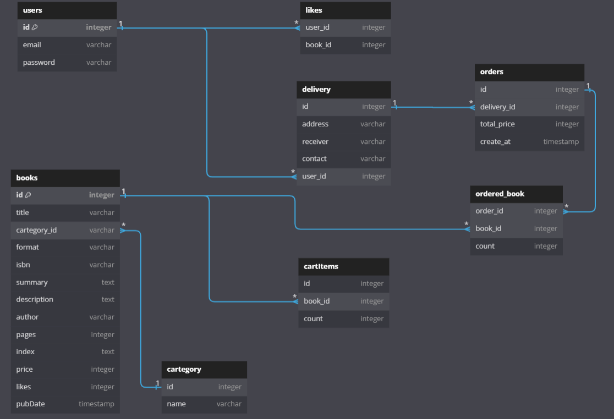

# lugia574.github.io

프로그래머스 스프린트 project

[깃헙 배포 페이지 링크](https://lugia574.github.io/)

## 이제까지 한거

- 패키지 구조 개편

- 그에 따른 모듈화

  model, dto, response 등 분리

- 해당 API 돌아가는지 체크 >> book 기능 하다가 컬럼 조정해야지 하고 멈춤

- mvc 로 완전히 분리

## ToDo List

- 예외처리

- 유효성검사
